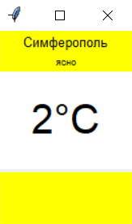

<p align="center">МИНИСТЕРСТВО НАУКИ  И ВЫСШЕГО ОБРАЗОВАНИЯ РОССИЙСКОЙ ФЕДЕРАЦИИ<br>
Федеральное государственное автономное образовательное учреждение высшего образования<br>
"КРЫМСКИЙ ФЕДЕРАЛЬНЫЙ УНИВЕРСИТЕТ им. В. И. ВЕРНАДСКОГО"<br>
ФИЗИКО-ТЕХНИЧЕСКИЙ ИНСТИТУТ<br>
Кафедра компьютерной инженерии и моделирования</p>
<br>
<h3 align="center">Отчёт по лабораторной работе № X<br> по дисциплине "Программирование"</h3>
<br><br>
<p>студента 1 курса группы ПИ-б-о-202(1)<br>
Баранского Никиты Александровича<br>
направления подготовки 09.03.04 "Программная инжененрия"</p>
<br><br>
<table>
<tr><td>Научный руководитель<br> старший преподаватель кафедры<br> компьютерной инженерии и моделирования</td>
<td></td>
<td>Чабанов В.В.</td>
</tr>  
</table>
<br><br>
<p align="center">Симферополь, 2020</p>
<hr>

Цель:

1. Закрепить навыки разработки многофайловыx приложений;
2. Изучить способы работы с API web-сервиса;
3. Изучить процесс сериализации/десериализации данных в/из json;
4. Получить базовое представление о сетевом взаимодействии приложений;

## Постановка задачи
________________________________________________________________


Разработать сервис предоставляющий данные о погоде в городе Симферополе на момент запроса.  В качестве источника данных о погоде используйте: http://openweathermap.org/. В состав сервиса входит: серверное приложение на языке С++ и клиентское приложение на языке Python.

Серверное приложение (далее Сервер) предназначенное для обслуживания клиентских приложений и минимизации количества запросов к сервису openweathermap.org. Сервер должен обеспечивать возможность получения данных в формате JSON и виде html виджета (для вставки виджета на страницу будет использоваться iframe).

Клиентское приложение должно иметь графический интерфейс отображающий сведения о погоде и возможность обновления данных по требованию пользователя.


## Выполнение работы
________________________________________________________________
</br>

### 1. Изучил структуру http-запроса.
</br>

- Изучил из каких элементов состоит запрос.
- Изучил назначение таких элементов запроса как:
    + Протокол
    + Хост
    + Сетевой порт
    + Путь к ресурсу
    + Query string
    + Якорь

### 2. Осуществил подготовку к работе с серисом openweathermap.org. 
</br>

1. Зашел на сайт сервиса  OpenWeatherMap.
2. Зарегистрировался в сервисе.
3. В разделе сайта "My API keys" нашел присвоенный моему аккаунту API ключ.<br>
`13fda1439b44a8ade1b03e584c366ec5`
4. Перешел в раздел сайта "Get Started" и изучил как посроить http-запрос к каднному сервису
   1. Изучил как посроить http-запрос.
   - Определил путь к сервису: `/data/2.5/onecall?`
   - Определил какие элементы query string используются в запросах к этому сервису:
   `lat` - для указания координаты широты точки для которой требуется определить погодные условия.</br>
   `lon` - для указания координаты долготы точки для которой требуется определить погодные условия.</br>
   `appid` - для указания API ключа пользователя.</br>
   `exclude` - для исключения из сводки блоко ненужной информации.</br>
   `units` - для указания метрической сиситемы в которой предоставляются данные.</br>
   `lang` - для языка представления данных.</br>
   - Определил какие значения используются для элементов query string:</br>
   `exclude`: current - текущая погода, minutely - поминутный прогноз на один час, hourly - почасовой прогноз на двое суток, daily - прогноз по дням на семь дней, alerts - предупреждения от гос. служб.</br>
   `units`: standard - температура в кельвинах\скорость в местах в секунду, metric - температура в градусах Цельсия\скорость в местах в секунду,  imperial - температура в градусах Фаренгейта\скорость в милях в час.
   2. Изучил содержание ответа на запрос.
   5. Составил запрос к сервису.
    </br></br>
    `http://api.openweathermap.org/data/2.5/onecall?appid=13fda1439b44a8ade1b03e584c366ec5&lat=44.9572&lon=34.1108&exclude=daily,minutely,current,alerts&lang=ru&units=metric`

    </br>
   6. Протестировал запрос в браузере.</br>
    На отправленный запрос получил ответ:</br></br>

    `{"lat":44.96,"lon":34.11,"timezone":"Europe/Simferopol","timezone_offset":10800,"hourly":[{"dt":1605963600,"temp":5.05,"feels_like":1.31,"pressure":1026,"humidity":75,"dew_point":0.99,"clouds":96,"visibility":10000,"wind_speed":2.72,"wind_deg":17,"weather":[{"id":804,"main":"Clouds","description":"пасмурно","icon":"04d"}],"pop":0.01},......]}`
</br>

### 3. Осуществил подготовку к работе с сервисом worldtimeapi.org.
</br>

1. Зашел на сайт сервиса  worldtimeapi.
2. Изучил построение запроса для данниго города.
   - Определил ппуть к сервису для моего города.</br>
   `/api/timezone/Europe/Simferopol`
3. Составил запрос к сервису.</br>
`http://worldtimeapi.org/api/timezone/Europe/Simferopol`
4. Протестировал запрос в браузере.</br>
    На отправленный запрос получил ответ:</br></br>
`{"abbreviation":"MSK","client_ip":"185.146.212.87","datetime":"2020-11-21T16:48:17.033676+03:00","day_of_week":6,"day_of_year":326,"dst":false,"dst_from":null,"dst_offset":0,"dst_until":null,"raw_offset":10800,"timezone":"Europe/Simferopol","unixtime":1605966497,"utc_datetime":"2020-11-21T13:48:17.033676+00:00","utc_offset":"+03:00","week_number":47}`

</br>

### 4. Приступил к подготовке серверного приложения.
1. Создал сервер.
    1. Создал папку "01" для этой лабораторной работы.
    2. В этой папке создал папку "c++" для проектов на языке "c++".
    3. Создал проект "serverLab1".
    4. В папке с главным .cpp файлом создал папку "include" для включаемых файлов.
    5. Перешел по ссылке  https://github.com/yhirose/cpp-httplib в GitHub репозиторий библиотеки для работы с сетью в c++.
    6. Скачал заголовочный файл httplib.h.
    7. Поместил файл httplib.h в папку "include".
    8. Открыл проект в Visual Studio и добавил в стандартые пути поиска заголовочных файлов путь к папке "include".
    9. Скопировал приведенный в методичке код.

    ```   #include <iostream>
    #include <httplib.h>
    using namespace httplib;

    void gen_response(const Request& req, Response& res) {
    res.set_content("Hello, World!", "text/plain");
    }
    int main(){
    Server svr;                   
    svr.Get("/", gen_response);   
    std::cout << "Start server... OK\n";
    svr.listen("localhost", 1234); 
    }
    ```
    10. Протестировал программу.
    - В командной строке увидел сообщение "Start server... OK".
    - Отпровив запрос "http://localhost:1234/" в браузере получил ответ в виде "Hello, World!".
    11. Сделал вывод что сервер работает исправно.

2. Создал отправщик запросов.
    1. Создал новый проект "getTrain" в папке "c++".
    2. В папке с главным .cpp файлом создал папку "include" для включаемых файлов.
    3. Поместил файл httplib.h в папку "include".
    4. Открыл проект в Visual Studio и добавил в стандартые пути поиска заголовочных файлов путь к папке "include".
    5. Скопировал приведенный в методичке код.
    ```
    #include <iostream>
    #include <httplib.h>
    using namespace httplib;
    
    int main(){
    Client cli("http://worldtimeapi.org");
    auto res = cli.Get("/api/timezone/Europe/Simferopol");
    if (res) {
        if (res->status == 200) {
        std::cout << res->body << std::endl;
        }else{
        std::cout << "Status code: " << res->status << std::endl;
        }
    }
    else {
        auto err = res.error();
        std::cout << "Error code: " << err << std::endl;  
    }
    }
    ```
    6. Протестировал программу.</br>
    Запустив программу увидел в командной строке текст ответа с сайта worldtimeapi.org (текст ответа с этого сайта уже был приведен в разделе 3).
    
    11. Сделал вывод что программа работает исправно.

### 5. Работа с JSON

1. Создал проект "workWithJson".
2. В папке с главным .cpp файлом создал папку "include" для включаемых файлов.
3. Перешел по ссылке   https://github.com/nlohmann/json в GitHub репозиторий библиотеки для работы с сетью в c++.
4. Скачал заголовочный файл json.hpp.
5. Поместил файл json.hpp в папку "include".
6. Открыл проект в Visual Studio и добавил в стандартые пути поиска заголовочных файлов путь к папке "include".
7. Скопировал приведенный в методичке код.
```
#include <iostream>
#include <string>
#include <json.hpp>
using json = nlohmann::json;
using namespace std;
 
int main()
{
string str =
R"({
  "pi": 3.141,
  "happy": true,
  "name": "Niels",
  "nothing": null,
  "answer": {
    "everything": 42
  },
  "list": [1, 0, 2],
  "object": {
    "currency": "USD",
    "value": 42.99
  }
})";
 
  json j = json::parse(str);
  double pi = j["pi"];                 cout << "pi " << pi << endl;
  bool happy = j["happy"];             cout << "happy " << happy << endl;
  string name = j["name"];             cout << "name " << name << endl;
  double value = j["object"]["value"]; cout << "value " << value << endl;
  cout << "every " << to_string(j["answer"]["everything"].get<int>());
  cout << to_string(j["answer"]["everything"].get<int>()) << endl;
  for (int i = 0; i < j["list"].size(); i++)
    cout << "list[" << i << "] = " << j["list"][i] << endl;
  json j2;
  j2["num"] = 1;
  j2["array"] = json::array();
  j2["array"].push_back(1);
  j2["array"].push_back(2);
  j2["object"] = json::object();
  j2["object"].push_back({"PI", pi});
  j2["object"].push_back({"exp", 2.71});
  std::cout << j2.dump(4);
}
```
8. С помощью данного кода я улучшил свои навыки работы с JSON.

### 6. Приступил к модернизации серверного приложения в проекте "serverLab1".

1. В функции "main" добавил слушатель обращения к "/raw" и заменил порт на 3000
    ```
    int main() {
        Server svr;                    
        svr.Get("/", gen_response);   
        svr.Get("/raw", gen_responseRaw);
        std::cout << "Start server... OK\n";
        svr.listen("localhost", 3000); 
    }
    ```
2. Создал функцию которая будет возвращать номер часа в массиве hourly ответа от openweathermao.org.

    ```int getNumOfHour() {
        int locItem = 0;
        int sec = 0;
        if (cache == "") {


            Client cli("http://api.openweathermap.org");
            auto res = cli.Get("/data/2.5/onecall?appid=13fda1439b44a8ade1b03e584c366ec5&lat=44.9572&lon=34.1108&exclude=daily,minutely,current,alerts&lang=ru&units=metric");
            if (res) {
                if (res->status == 200) {
                    cache = json::parse(res->body);
                }
                else {
                    std::cout << "1Openweathermap status code: " << res->status << std::endl;
                }
            }
            else {
                auto err = res.error();
                std::cout << "1Openweathermap error code: " << err << std::endl;
            }


        }
        else {


            
            Client cli("http://worldtimeapi.org");
            auto res = cli.Get("/api/timezone/Europe/Simferopol");
            if (res) {
                if (res->status == 200) {
                    sec = json::parse(res->body)["unixtime"].get<int>();
                }
                else {
                    std::cout << "Worldtimeapi status code: " << res->status << std::endl;
                }
            }
            else {
                auto err = res.error();
                std::cout << "Worldtimeapi error code: " << err << std::endl;
            }


            int checkActual = 0;
            
            if (sec) {
                for (int i = 0; i < 48; i++) {
                    if ((cache["hourly"][i]["dt"] - sec) > 0 && (cache["hourly"][i]["dt"] - sec) <= 1600) {
                        checkActual = cache["hourly"][i]["dt"];
                        locItem = i;
                        break;
                    }
                }
            }
            


            if (!checkActual) {

                Client cli("http://api.openweathermap.org");
                auto res = cli.Get("/data/2.5/onecall?appid=13fda1439b44a8ade1b03e584c366ec5&lat=44.9572&lon=34.1108&exclude=daily,minutely,current,alerts&lang=ru&units=metric");
                if (res) {
                    if (res->status == 200) {
                        cache = json::parse(res->body);
                    }
                    else {
                        std::cout << "Openweathermap status code: " << res->status << std::endl;
                    }
                }
                else {
                    auto err = res.error();
                    std::cout << "Openweathermap error code: " << err << std::endl;
                }
            }
        }
        if (cache == "")
            locItem = -1;
        return locItem;
    }
    ```
    Алгоритм работы данной функции:

    cache - глобальная переменная JSON хранящая данные с ответа openweathermap.
   1. Проверяет наличие данных в cache.
   2. Если данных нет, то отправляет запрос на openweathermap, записывает данные из ответа в cache и возвращает 0.
   3. Если данные есть - осуществляется проверка из актуальности.
      1. Отправляет запрос на worldtimeapi и записывает полученное время в переменную sec.
      2. Ищет в cache данные соответствующие текущему времени и возвращает номер часа в массиве hourly. В checkActual записывается время из найденного элемента массива. Если такие данные не нашлись то checkActual остается равным нулю.
   4. Если данные актуальные на текущий час не нашлись, то отправляет запрос на openweathermap, записывает данные из ответа в cache и возвращает 0.

3. Модифицировал функцию gen_response.

    ```
    void gen_response(const Request& req, Response& res) {
        int item = getNumOfHour();
        
        std::string tempFile;

        std::string repStr[4] = { "{hourly[i].weather[0].description}","{hourly[i].weather[0].icon}","{hourly[i].temp}","{hourly[i].temp}" };
        

        std::string pathTemplate = "index.html";

        std::ifstream templateFile;
        if (item >= 0) {
            templateFile.open(pathTemplate);

            auto temp = cache["hourly"][item];

            if (!templateFile.is_open()) {
                std::cout << "Не удалось открыть файл шаблона виджета.";
            }
            else {
                
                getline(templateFile, tempFile, '\0');

                tempFile.replace(tempFile.find(repStr[0]), repStr[0].length(), temp["weather"][0]["description"].get<std::string>());
                tempFile.replace(tempFile.find(repStr[1]), repStr[1].length(), temp["weather"][0]["icon"].get<std::string>());
                tempFile.replace(tempFile.find(repStr[2]), repStr[2].length(), temp["temp"].get<std::string>());
                tempFile.replace(tempFile.find(repStr[3]), repStr[3].length(), temp["temp"].get<std::string>());


            }
        }
        
        res.set_content(tempFile , "text/html");
    }
    ```
    Алгоритм ее работы:
    1. Осуществляет проверку адекватности работы функции getNumOfHour.
    2. Открывает файл шаблона виджета index.html.
    3. Проверяет открылся ли файл.
    4. Если файл открыт копирует его содержимое в переменную tempFile и заменяет текст заглушку в нем на данные из элемента массива hourly под номером item полученным с помощью функции getNumOfHour.
    5. Отправляет ответ с готовым виджетом.

4. Создал функцию gen_responseRaw для отправки ответа на запрос к "/raw".

    ```
    void gen_responseRaw(const Request& req, Response& res) {
        int item = getNumOfHour();
        if (item >= 0) {
            auto temp = cache["hourly"][item];
            json result = {
                {"temperature", temp["temp"].get<int>()},
                {"description", temp["weather"][0]["description"].get<std::string>()}
            };

            res.set_content(result.dump(), "text/json");
        }
    }
    ```
    Алгоритм ее работы:
    1. Осуществляет проверку адекватности работы функции getNumOfHour.
    2. Подставляет в JSON данные из элемента массива hourly под номером item.
    3. Отправляет ответ.

    При запросе к корню сайта в браузере отображается следующая страница:

    
   <div align = "center"></div>
    <p align = "center">Рисунок 1. Окно браузера с загруженным виджетом.</p>

### 7. Приступил к созданию клиентского приложения.

</br>

1. В папке "01" создал папку "python" для проектов на языке "Python".
2. Создал проект "client".
3. установил модуль requests.
4. Импортировал Tkinter и json.

    Код приложения:

    ```
    from tkinter import *
    import json
    import requests

    def click(event):
        quest()

    def  quest():
        res = requests.get("http://localhost:3000/raw")
        info = res.json()
        desc.config(text=str(info["description"].encode('l1').decode()))
        main.config(text=str(info["temperature"]) + "°C")

    root = Tk()
    root.bind("<Button-3>", )
    root.geometry('130x190')
    root.title("Погода")

    head = Label(root, text = "Симферополь", bg = "yellow", width = 20, height = 1, font = ("bold", 10))
    desc = Label(root, bg = "yellow", width = 30, height = 1, font = ("default" ,7))
    main = Label(root, bg = "white",  width = 10, height = 2, font = ("bold" ,30))
    footer = Label(root, height = 3, width = 20 ,bg = "yellow" )

    head.pack(side = TOP)
    desc.pack(side = TOP)
    main.pack(side = TOP)
    footer.pack(side = BOTTOM)


    quest()

    root.mainloop()
    ```

    При запуске открывается окно вида:

<div align = "center"></div>
<p align = "center">Рисунок 2. Окно клиентского приложения.</p>


### 8. Создание туннеля.

1. Скачал программу ngrok и распаковал ее.
2. Запустил и ввел команду `ngrok.exe http 3000`
3. В терминале увидел информацию мониторинга подключения 3000 порта.


### Вывод:
С помощью данной лабораторной работы были закреплены навыки работы с системой взаимодействия приложений между собой. В частности навыки работы с составлением запросов и ответов на них с помощью приложений, навыки работы с json форматом передачи данныхб навыки построения алгоритма взаимодействия приложений. А также такие навыки как создание сервера и настройки графических оболочек с помощью библиотек.


    


