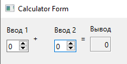

МИНИСТЕРСТВО НАУКИ  И ВЫСШЕГО ОБРАЗОВАНИЯ РОССИЙСКОЙ ФЕДЕРАЦИИ 
Федеральное государственное автономное образовательное учреждение высшего образования 
"КРЫМСКИЙ ФЕДЕРАЛЬНЫЙ УНИВЕРСИТЕТ им. В. И. ВЕРНАДСКОГО" 
ФИЗИКО-ТЕХНИЧЕСКИЙ ИНСТИТУТ 
Кафедра компьютерной инженерии и моделирования

 
<h3 align="center">Отчёт по лабораторной работе № 4  по дисциплине "Программирование"</h3>
  

студента 1 курса группы ПИ-б-о-202(1) 
Баранского Никиты Александровича 
направления подготовки 09.03.04 "Программная инжененрия"

  
<table>
<tr><td>Научный руководитель  старший преподаватель кафедры  компьютерной инженерии и моделирования</td>
<td></td>
<td>Чабанов В.В.</td>
</tr>  
</table>
  

Симферополь, 2020

Цель:

Установить фреймворк Qt; 
Изучить основные возможности создания и отладки программ в IDE Qt Creator.

## Постановка задачи
________________________________________________________________

Настроить рабочее окружение, для разработки программного обеспечения при помощи Qt и IDE Qt Creator, а также изучить базовые возможности данного фреймворка.

## Выполнение работы
________________________________________________________________
 

### 1. Установка фреймворка Qt и её проверка.

1. Скачал и установил фреймворк Qt.
2. Совершил проверку на наличие нужных компонентов путем замены в готовом проекте "Calculator Form Example" надписей над полями ввода-вывода.

    
Рисунок 1. Окно калькулятора с замененными надписями.

### 2. Ответы на вопросы.

1. Как изменить цветовую схему (оформление) среды?

    1. Инструмены >> Параметры >> Среда
    2. Во вкладке интерфейс выбрать цветовую схему.
2. Как закомментировать/раскомментировать блок кода средствами Qt Creator? Имеется ввиду комбинация клавиш или пункт меню.
    1. Комбинация Cntr+/
3. Как открыть в проводнике Windows папку с проектом средствами Qt Creator?
    1. Вызвать контекстное меню нужного файла.
    2. Выбрать пункт "Показать в проводнике".
4. Какое расширение файла-проекта используется Qt Creator? Может быть несколько ответов.

    .pro
5. Как запустить код без отладки?

    Кмбинация Cntr+R или нажать на кнопку "Запустить" в нижнем левом углу(Кнопка пуск).
6. Как запустить код в режиме отладки?
    1. Выбрать режим Отладки в левом нижнем углу.
    2. Нажать кнопку "Начать отладку запускающего проекта" в нижнем левом углу.(Кнопка пуск с жуком)
7. Как установить/убрать точку останова (breakpoint)?
    Точки останова устанавливаются/убираются кликом по нужной строке левее ее номера или в меню Отладка >> Поставить/снять точку останова, а также клавишей F9.
### 3. Создание консольного приложения без Qt.

1. Создал проект.
2. Скопировал в главный файл код предложенный в задании.
3. Установил точки останова.
4. Выяснил значения переменных в указанных строках.
    <table>
    <tr>
    <td>№ строки</td>
    <td> значение i</td>
    <td>значение d</td>
    </tr>
    <tr>
    <td>6</td>
    <td>0</td>
    <td>7.8037075881849882e-318</td>
    </tr>
    <tr>
    <td>7</td>
    <td>5</td>
    <td>7.8037075881849882e-318</td>
    </tr>
    <tr>
    <td>8</td>
    <td>5</td>
    <td>5</td>
    </tr>
    </table>

### 4. .gitignor.

1. Скопировал текст документа gitignore для работы с Qt с github.
2. Вставил новые строки в уже имеющийся файл gitignore в корне моего репозитория.

## Вывод.
________________________________________________________________
В ходе выполнения работы был успешно установлен фреймворк Qt, а также изучены основные возможности работы в фреймворке и Qt Creator. Было получено представление о возможностях и пренадзначении фреймворка.

